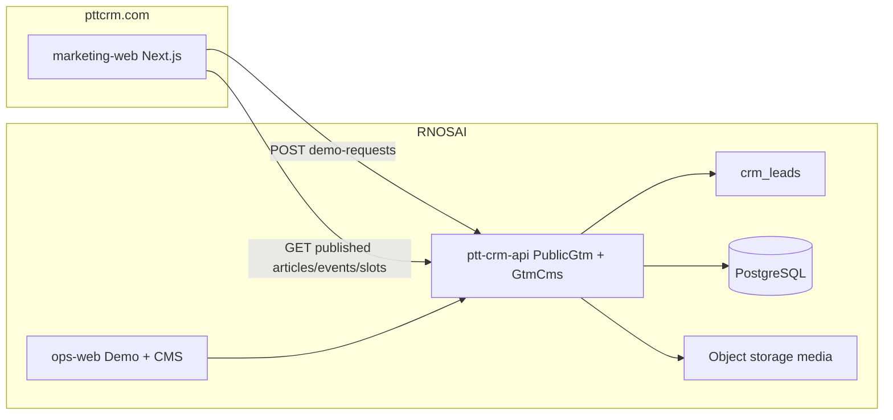

# PTTCRM — Master Specification

> **Document ID:** PTTCRM-MASTER-20260815  
> **Phiên bản:** 1.2 · **Ngày:** 2026-08-15  
> **Trạng thái:** Draft — chờ PO / GDKD / MKT sign-off  
> **1.1:** Nav W0, tin tức W0, hệ màu 4 lớp (từ HTML demo đã duyệt)  
> **1.2:** CMS nội bộ W0 — media, tin tức, sự kiện; site chỉ đọc bản published  
> **Loại:** Product + GTM master spec  
> **Engine:** RNOSAI (`/Users/quoctuan/Documents/CursorAI/RNOSAI`)  
> **Con:** [SRS](./2026-08-15-pttcrm-srs.md) · [UX/UI](./2026-08-15-pttcrm-ui-ux.md) · [Use Case](../use-cases/01-PTTCRM-COMMERCIAL.md)

---

## Mục lục

1. [Tầm nhìn & category](#1-tầm-nhìn--category)
2. [Quyết định đã khóa](#2-quyết-định-đã-khóa)
3. [Thương hiệu](#3-thương-hiệu)
4. [Đối thủ & cách thắng](#4-đối-thủ--cách-thắng)
5. [Persona](#5-persona)
6. [SKU & giá](#6-sku--giá)
7. [Kiến trúc](#7-kiến-trúc)
8. [Lộ trình A+ → D0 → D1 → US/EU](#8-lộ-trình-a--d0--d1--useu)
9. [Phạm vi / ngoài phạm vi](#9-phạm-vi--ngoài-phạm-vi)
10. [KPI doanh số](#10-kpi-doanh-số)
11. [Traceability](#11-traceability)
12. [Sign-off](#12-sign-off)

---

## 1. Tầm nhìn & category

PTTCRM là **CRM tốt nhất về Marketing**: một nền tảng, chuyên biệt từng ngành.

Công chúng thấy **PTTCRM**. Không in logo hay tiêu đề «RNOSAI» trên site, báo giá, hợp đồng mẫu. RNOSAI là tên engine nội bộ (ops-web, portal-web, `ptt-crm-api`).

**Câu pitch (VI):** Getfly giúp lưu khách hàng. Base giúp quản trị nhiều module. PTTCRM giúp marketing ra hợp đồng — biết ads nào ra HĐ, CPL/ROAS theo ngành, portal cho từng client.

**Câu pitch (EN):** One platform, specialized by industry. Marketing CRM for performance teams and agencies — ads to contract to ROAS, not another generic CRM.

**Không** định vị: CRM SME giá rẻ · HRM · ERP · landing-page builder.

---

## 2. Quyết định đã khóa

| ID | Quyết định | Giá trị |
|----|------------|---------|
| DEC-01 | Brand công khai | PTTCRM |
| DEC-02 | Slogan VI | Một nền tảng, chuyên biệt từng ngành |
| DEC-03 | Slogan EN | One platform, specialized by industry |
| DEC-04 | Category | Marketing CRM |
| DEC-05 | Motion VN | **A+** — CTA Đăng ký Demo; sandbox 14 ngày chỉ sau demo đạt chuẩn |
| DEC-06 | Motion global | **D0** site VI/EN trên `pttcrm.com` → **D1** ASEAN → US/EU sau |
| DEC-07 | Không | Trial 30 ngày tự phục vụ · niêm yết giá theo seat kiểu Getfly |
| DEC-08 | Logo | Monogram P teal `#0090A0` + node mạng trắng, nền đen — `brand/pttcrm-logo-monogram.png` |
| DEC-09 | 3 SKU | Marketing · Industry · Agency OS |
| DEC-10 | 3 ngành W0 | Bất động sản · Agency · F&B |
| DEC-11 | Nav W0 | Giải pháp → Nền tảng → Bảng giá → Tài nguyên. Không phone trên header |
| DEC-12 | Tin tức / sự kiện | W0 từ **CMS**. Không bài tĩnh trong repo (trừ seed lần đầu). Không số case bịa |
| DEC-13 | Màu | 4 lớp: Ink · Paper · Surface · Wash. Accent teal `#0090A0` duy nhất |
| DEC-14 | CMS | Headless nội bộ trên RNOSAI (`GtmCmsModule` + ops-web `/crm/gtm/cms`). Không WordPress / Sanity / Contentful |
| DEC-15 | Media | Mọi ảnh site (trừ logo/favicon/legal PDF trong `brand/`) phải có trong thư viện CMS |
| DEC-16 | Publish | Public site chỉ render `status=published`. Draft không lộ URL, không vào sitemap |

---

## 3. Thương hiệu

| Token | Giá trị |
|-------|---------|
| Primary / teal | `#0090A0` |
| Teal bright | `#12C4D4` — kicker, số trên nền tối |
| Teal ink | `#006B75` — link / hover trên giấy |
| Ink | `#061418` — hero, mast, dải ngành, CTA, footer |
| Paper | `#EEF7F8` — nền trang |
| Surface | `#FFFFFF` — card, header, mega menu |
| Wash | `#D4EEF1` — trust, triển khai, gói Industry nổi |
| Node / inverse | `#FFFFFF` |
| Wordmark | `PTTCRM` — sans geometric, tracking rộng, không chữ đậm toàn bộ |
| Icon | Monogram P; trên nền sáng đặt trong ô vuông đen 40×40; trên nền tối dùng file gốc |
| Domain production | `https://pttcrm.com` |
| Alias VN | `https://pttcrm.vn` → 301 `https://pttcrm.com/vi` |
| App staff (W0–W2) | `https://rs.pttads.vn` — nút Đăng nhập |
| Portal (W0–W2) | `https://portal.pttads.vn` |
| App public (W3+) | `https://app.pttcrm.com` CNAME tới cùng origin khi PO cutover |

Ngôn ngữ site: `vi` và `en`. URL `/vi/...` và `/en/...`. `/` chọn locale theo `Accept-Language`; không khớp → `vi`.

**Nguồn giao diện đã duyệt (W0):** `demo-html/` — Next.js W0 phải khớp token, IA nav, nhịp màu home, mega đặc. Không quay lại giấy `#F7FBFB` / ink `#0B0F10`.

---

## 4. Đối thủ & cách thắng

| Đối thủ | Sân | PTTCRM thắng bằng | Không đua |
|---------|-----|-------------------|-----------|
| Getfly | CRM SME VN | Attribution ads→HĐ, ACV cao, demo ngành | Giá ~31k/user, trial 30 ngày |
| Base | Suite quản trị VN | Sâu Marketing + tab ngành, không rộng HR/Finance | GPS, HRM, ISO mọi ngành |
| HubSpot | Global SMB | Agency multi-client + ROAS portal | Marketing Hub bề rộng |
| Salesforce | Enterprise CRM | Time-to-value ngành, giá consult VN/ASEAN | Custom object depth |
| Pipedrive | PLG pipeline | Closed-loop ads, không chỉ deal board | Self-serve rẻ |

Ba moat giữ nguyên từ spec Competitive Win RNOSAI:

1. Closed-loop spend → lead → deal → ROAS  
2. Agency OS: multi-client + portal + Launch QA  
3. Handoff Sales→Solution + RBAC kiểu DN Việt  

---

## 5. Persona

| Mã | Persona | Câu hỏi chốt | Proof trên demo | SKU mặc định |
|----|---------|--------------|-----------------|--------------|
| P-AO | Agency owner 30–100 client | CPL/ROAS từng client? | Portal + hub map | Agency OS |
| P-GD | GDKD agency | Ai chịu SLA handoff? | Queue + KPI | Agency OS hoặc Industry |
| P-BM | Brand in-house MKT | Ads nào ra deal? | Attribution lead→HĐ | Industry |
| P-RE | Chủ đầu tư / sàn BĐS | Lead dự án nào ra booking? | Vertical BĐS | Industry |
| P-FB | Chủ chuỗi F&B | Campaign nào ra lượt đặt / CRM cửa hàng? | Vertical F&B | Industry |
| P-IT | IT 80+ NV | SSO, audit, scope? | Chỉ demo khi deal W2+ | Mọi SKU |
| P-SEA | Agency performance ASEAN | Multi-client ROAS, English UI? | Sandbox EN + USD quote | Agency OS |

HR/CFO payroll **không** là persona mua W0–W1.

---

## 6. SKU & giá

Giá là **list price v1** — in trên `/bang-gia` và `/en/pricing` dạng «từ». Sales được chiết khấu tối đa 15% trên retainer tháng, không được hạ dưới sàn DEC-07.

### 6.1. SKU

| SKU | Tên | Bao gồm | Không gồm |
|-----|-----|---------|-----------|
| `mkt` | PTTCRM Marketing | CRM lead/KH/CSKH, ingest Meta/Zalo lead, KPI cơ bản | Playbook ngành, portal multi-client |
| `ind` | PTTCRM Industry | `mkt` + 1 industry pack + attribution ads→HĐ | Portal nhiều client agency |
| `agy` | PTTCRM Agency OS | `ind` + multi-client + portal ROAS + handoff SLA | Payroll/BHXH, ERP |

Industry pack W0: `bds` · `agency` · `fnb`. Một HĐ `ind` chọn đúng 1 pack. Đổi pack = change order.

### 6.2. List price Việt Nam (W0)

| SKU | Retainer / tháng | Setup một lần | Band mặc định |
|-----|------------------|---------------|---------------|
| `mkt` | 4.900.000 VND | 8.000.000 VND | 1–10 user |
| `ind` | 9.900.000 VND | 12.000.000 VND | 1–10 user + 1 pack |
| `agy` | 19.900.000 VND | 20.000.000 VND | 5 client workspace |

User band vượt 10: +490.000 VND / user / tháng (`mkt`/`ind`). Client workspace vượt 5: +3.900.000 VND / client / tháng (`agy`).

**Cấm** hiển thị giá quy về «mỗi user / tháng» dưới 200.000 VND.

### 6.3. List price USD (công bố khi W2; cấu hình sẵn W0 ẩn)

| SKU | Retainer / tháng | Setup |
|-----|------------------|-------|
| `mkt` | 199 USD | 400 USD |
| `ind` | 399 USD | 600 USD |
| `agy` | 799 USD | 1.200 USD |

Sàn quy về user: không dưới 15 USD / user / tháng.

### 6.4. Chu kỳ

Hợp đồng tối thiểu 12 tháng. Thanh toán quý hoặc năm. Năm được −10% retainer (không cộng với chiết khấu sales vượt 15%).

---

## 7. Kiến trúc

| Thành phần | Repo | Nhiệm vụ |
|------------|------|----------|
| `marketing-web` | PTTCRM `apps/web` | Site VI/EN, SEO, form demo; **ISR** nội dung CMS |
| `PublicGtmModule` | RNOSAI `ptt-crm-api` | API công khai demo, rate limit, tạo lead |
| `GtmCmsModule` | RNOSAI `ptt-crm-api` | Media, bài, sự kiện, slot ảnh; public GET + staff CRUD |
| Demo inbox | RNOSAI `ops-web` `/crm/gtm/demos` | Sales qualify, book demo, grant sandbox |
| CMS desk | RNOSAI `ops-web` `/crm/gtm/cms` | MKT soạn / xuất bản |
| Object storage | S3-compatible (env) | File ảnh; URL CDN công khai |
| Engine CRM/Ads/Portal/AI | RNOSAI hiện hữu | Không fork |

Site **không** ghi thẳng Postgres. Lead đi API demo. Nội dung tin / sự kiện / ảnh đi API CMS. Copy **cố định** (giá SKU, pháp lý, slogan, nav) vẫn trong repo — CMS không sửa list price.

**Không** dùng `SeoCmsModule` (webhook SEO khách hàng) cho site PTTCRM.

---

## 8. Lộ trình A+ → D0 → D1 → US/EU

### W0 — Máy bán VN + cửa English (6 tuần)

- Site `pttcrm.com` VI/EN: home, 4 trang sản phẩm, 3 ngành, giá, demo, legal, **tin tức + sự kiện** (từ CMS)
- CMS desk: thư viện ảnh, bài, sự kiện, slot ảnh trang tĩnh; seed 6 bài demo
- Form → lead `source=pttcrm_web` + UTM
- Demo inbox + SLA phản hồi 4 giờ giờ hành chính VN
- Nút Đăng nhập → `rs.pttads.vn`
- Meta Pixel + UTM (không tự build LP builder)

**Exit W0:** 1 demo/ngày giả lập UAT xanh; Lighthouse SEO ≥ 90 trang chủ; form tạo lead trên staging.

### W1 — Tăng close (6 tuần)

- 3 case CPL/ROAS số thật (PO cung cấp số; site không bịa)
- Sandbox 14 ngày: Sales bấm grant sau demo `qualified`
- Excel import/export lead + proposal PDF — thực hiện trên RNOSAI (table stakes Getfly)
- Thêm ngành Education, Pharma trên site

**Exit W1:** 3 case published; grant sandbox tạo user `demo_*` hết hạn đúng 14 ngày.

### W2 — D0 sâu (8 tuần)

- Stripe USD + hóa đơn EN
- GDPR banner + DPA PDF
- i18n EN cho **sandbox shell** (login, lead list, 1 industry board) — không dịch 129 màn ops-web

**Exit W2:** Thanh toán test USD thành công; sandbox EN click được lead list.

### W3 — D1 ASEAN (8 tuần)

- Playbook bán TH / ID / PH / SG (nội dung EN, timezone, WhatsApp link)
- Partner 1 nước (Singapore hoặc Thái) — 1 trang `/en/partners`
- `app.pttcrm.com` CNAME khi PO chốt

**Exit W3:** 3 demo ASEAN trong pipeline (không bắt buộc won).

### W4 — US/EU

SOC2 type 1, region Singapore, SLA 99.9%. **Cấm** bắt đầu W4 khi W3 chưa có 3 demo ASEAN.

---

## 9. Phạm vi / ngoài phạm vi

### Trong phạm vi repo PTTCRM

Marketing-web, brand, copy VI/EN, sitemap, tracking, tài liệu GTM.

### Trong phạm vi RNOSAI (thay đổi có kiểm soát)

`PublicGtmModule`, `GtmCmsModule`, bảng `gtm_demo_request` + `gtm_cms_*`, route `/crm/gtm/demos` + `/crm/gtm/cms`, grant sandbox, Excel/PDF (W1), i18n sandbox (W2).

### Ngoài phạm vi mọi wave trừ khi PO exception

- Trial 30 ngày không qualification
- Niêm yết giá Getfly-style theo user rẻ
- Copy Base HRM / Finance / Workflow suite
- Landing page builder 1000 mẫu
- ERP, BHXH, GPS chấm công
- In chữ RNOSAI trên UI công khai
- SOC2 / US-EU trước W4
- Dịch toàn bộ ops-web sang EN trong W0–W1

---

## 10. KPI doanh số

| KPI | W0 (nội bộ) | W1 | W3 |
|-----|-------------|----|----|
| Demo request / tuần | ≥ 5 (ads + outbound) | ≥ 15 | ≥ 25 (kể cả EN) |
| Tỷ lệ form → lead hợp lệ | ≥ 95% | ≥ 97% | ≥ 97% |
| Phản hồi lead P50 | ≤ 4 giờ | ≤ 2 giờ | ≤ 2 giờ (GMT+7 hoặc +8) |
| Close rate demo→HĐ | đo baseline | ≥ 20% | ≥ 22% |
| ACV trung bình HĐ mới | ≥ 9.9tr VND/tháng | ≥ 12tr | ≥ 399 USD khi deal EN |
| % lead có UTM | ≥ 80% | ≥ 90% | ≥ 90% |

North star: **retainer tháng mới ký** — không phải số trial.

---

## 11. Traceability

| Artifact | ID |
|----------|----|
| SRS FR | FR-WEB-001…027 · FR-WEB-030…035 · FR-WEB-040 · FR-CMS-001…020 · FR-GTM-001…020 · FR-SAN-001…008 |
| Màn hình | SCR-WEB-001…021 · SCR-OPS-001…005 |
| Use case | GTM-UC-001…039 |
| Business rule | BR-GTM-001…026 |
| Competitive Win (engine) | `RNOSAI/docs/specs/2026-08-07-rnosai-competitive-win-master-spec.md` |

---

## 12. Sign-off

| Role | Name | Date | Quyết định |
|------|------|------|------------|
| PO | | | A+ → D0 → D1 · list price v1 |
| GDKD | | | SLA demo 4 giờ · chiết khấu ≤15% |
| MKT | | | Copy VI/EN · 3 ngành W0 · CMS tin/sự kiện/ảnh |
| IT | | | Domain `pttcrm.com` · DNS · Pixel |
