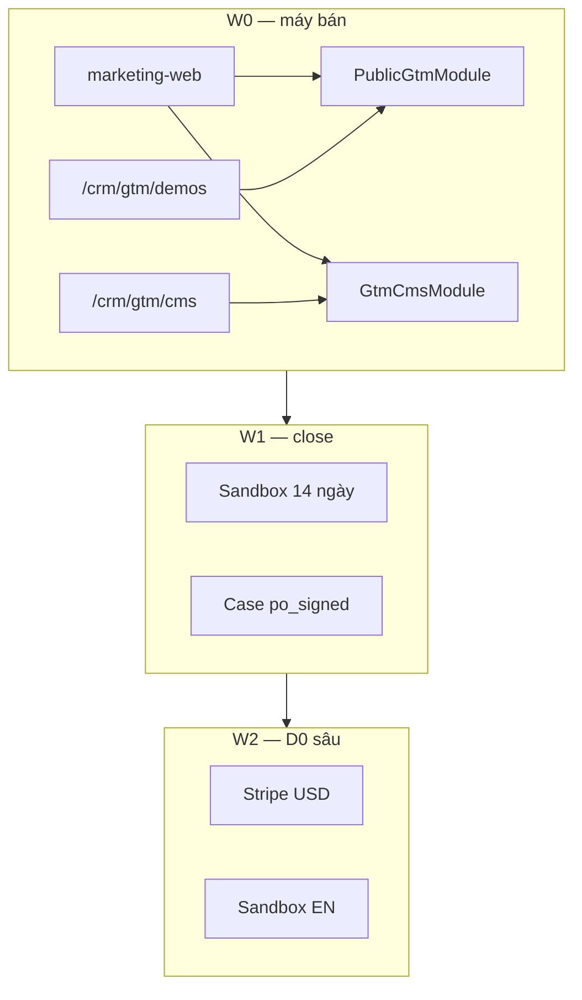

# PTTCRM System Implementation Plan

> **For agentic workers:** REQUIRED SUB-SKILL: Use superpowers:subagent-driven-development (recommended) or superpowers:executing-plans to implement this plan task-by-task. Steps use checkbox (`- [ ]`) syntax for tracking.
>
> **W0 chi tiết (chạy trước):** [2026-08-15-pttcrm-w0-v12.md](./2026-08-15-pttcrm-w0-v12.md)  
> **Plan W0 cũ (không dùng):** [2026-08-15-pttcrm-w0-commercial-site.md](./2026-08-15-pttcrm-w0-commercial-site.md) — thiếu CMS / sự kiện / nav 1.2.

**Goal:** Dựng máy bán PTTCRM từ site công khai đến lead + CMS, rồi lần lượt sandbox, USD, ASEAN — theo Master Spec v1.2.

**Architecture:** Hai repo. `PTTCRM` = marketing-web Next.js (`pttcrm.com`). `RNOSAI` = `ptt-crm-api` (`PublicGtmModule` + `GtmCmsModule`) và ops-web (`/crm/gtm/demos`, `/crm/gtm/cms`). Site không ghi Postgres. Lead `source=pttcrm_web`. Tin / sự kiện / ảnh chỉ bản `published`.

**Tech Stack:** Node 20, Next.js 15, React 19, TypeScript strict, Vitest, Playwright, NestJS, Jest, PostgreSQL, S3-compatible, pnpm.

## Global Constraints

- Brand công khai: `PTTCRM`. CI fail nếu `RNOSAI` trong `apps/web` hoặc body CMS publish.
- Slogan VI: `Một nền tảng, chuyên biệt từng ngành`. EN: `One platform, specialized by industry`.
- CTA: `Đăng ký Demo` / `Request demo`. Không trial 30 ngày. Không giá / user < `200000` VND.
- `/en/pricing` ẩn USD khi `NEXT_PUBLIC_USD_PRICE=0`.
- marketing-web port `3300`. Login `https://rs.pttads.vn/login`.
- Teal `#0090A0`. Ink `#061418`. Paper `#EEF7F8`. Wash `#D4EEF1`. Logo `brand/pttcrm-logo-monogram.png`.
- CMS nội bộ RNOSAI — không WordPress / Sanity / Contentful / `SeoCmsModule`.
- Ảnh site (trừ `brand/`) = `gtm_cms_media`. Giá / pháp lý / slogan = repo.
- Commit site trong PTTCRM; API/inbox/CMS desk trong `../RNOSAI`. Không trộn hai repo một commit.
- Visual SoT đến khi Next khớp: `demo-html/`.

---

## Hai repo

| Repo | Path | Việc |
|------|------|------|
| PTTCRM | `/Users/quoctuan/Documents/CursorAI/PTTCRM` | Site, copy cố định, ISR, Pixel, plan/spec |
| RNOSAI | `/Users/quoctuan/Documents/CursorAI/RNOSAI` | API GTM + CMS, DDL, ops-web desk, grant sandbox |

Engine CRM/Ads/Portal/AI **không fork**. Site chỉ bán và lấy nội dung.

---

## Wave và plan con

Mỗi wave = một plan chi tiết riêng (TDD, commit). **Chỉ viết/chạy plan wave sau khi wave trước exit xanh.**

| Wave | Plan file | Thời lượng | Exit |
|------|-----------|------------|------|
| **W0** | [w0-v12](./2026-08-15-pttcrm-w0-v12.md) — **chạy ngay** | 6 tuần | Form → lead; CMS publish → site; Lighthouse SEO ≥ 90; 1 demo/ngày UAT |
| **W1** | [w1-close](./2026-08-16-pttcrm-w1-close.md) — **chạy sau W0 exit** | 6 tuần | 3 case `po_signed`; sandbox 14 ngày hết hạn đúng |
| **W2** | [w2-d0](./2026-08-16-pttcrm-w2-d0.md) — **chạy sau W1 exit** | 8 tuần | Stripe test USD; sandbox EN lead list |
| **W3** | [w3-asean](./2026-08-16-pttcrm-w3-asean.md) — **chạy sau W2 exit** | 8 tuần | 3 demo ASEAN trong pipeline |
| **W4** | [w4-useu](./2026-08-16-pttcrm-w4-useu.md) — **chạy sau W3 exit** | 10–12 tuần | SOC2 Type 1 + Trust/Status; SLA 99.9% runbook |

---

## W0 — phạm vi (chi tiết ở plan con)

Ba luồng song song, ghép ở Task 9–12 của W0-v12.

| Luồng | Repo | Deliverable |
|-------|------|-------------|
| A Site | PTTCRM | Next 15 port 3300, chrome 1.2, trang tĩnh, form, tin/sự kiện ISR |
| B API | RNOSAI | DDL + `PublicGtmModule` + `GtmCmsModule` + S3 |
| C Desk | RNOSAI | Inbox demo + CMS 4 tab |

**Trong W0:** home editorial (không 3 card giá), 4 sản phẩm, 3 ngành, giá, demo, legal, about, tin, sự kiện, cookie, Pixel, UTM, mega, CMS media/article/event/slot, seed 6 bài.

**Ngoài W0:** Stripe, sandbox grant, case số, Education/Pharma, `/khach-hang`, `/tai-nguyen` hub, `/partners`, i18n 129 màn ops-web, WhatsApp, SOC2, LP builder.

---

## W1 — tăng close (sau W0)

- Case study: `gtm_cms_article` hoặc bảng `gtm_cms_case` với `po_signed=true` + `cpl_vnd` `roas`. Site `/vi/khach-hang` chỉ render flag đó.
- Grant sandbox: `POST .../sandbox` khi `qualified` \| `demo_booked`; user `demo_{requestId}`; tenant `sandbox_{industry}`; +14 ngày; email credential.
- Job hourly disable khi hết hạn.
- Excel import/export lead + proposal PDF **trên RNOSAI** (không làm trên marketing-web).
- Thêm ngành Education, Pharma trên site (trang giải pháp + prefill form).

**Cấm:** số case bịa; trial công khai; grant khi `new`.

---

## W2 — D0 sâu

- `NEXT_PUBLIC_USD_PRICE=1` → `/en/pricing` in §6.3 Master Spec.
- Stripe Checkout SKU USD + webhook `gtm_payment`.
- GDPR banner + DPA PDF (legal EN).
- Sandbox shell EN: login, lead list, 1 industry board. Không dịch toàn bộ ops-web.

---

## W3 — D1 ASEAN (sau W2)

Chi tiết: [w3-asean](./2026-08-16-pttcrm-w3-asean.md).

- Playbook TH / ID / PH / SG (`/en/markets/*` — copy EN, timezone, WhatsApp **link**).
- Form EN `market_country` + inbox filter ASEAN (RNOSAI).
- `/en/partners` — 1 partner (SG hoặc TH, PO chọn).
- Runbook `app.pttcrm.com` CNAME khi PO cutover.

**Exit:** 3 demo ASEAN trong pipeline; KPI demo/tuần ≥ 25, close ≥ 22%, ACV EN ≥ 399 USD.

---

## W4 — US/EU (sau W3)

Chi tiết: [w4-useu](./2026-08-16-pttcrm-w4-useu.md).

- SOC2 **Type 1** (evidence pack + Trust Center — report PO/auditor).
- Region **Singapore** — residency statement công khai.
- SLA **99.9%** — `/en/status` + public status API + runbook monitoring.

**Gate:** ≥ 3 demo ASEAN pipeline (W3 exit kinh doanh). **Cấm** code W4 trước gate.

---

## W4+ (ngoài plan W4)

- Dịch toàn bộ ops-web EN (129 màn) — wave riêng sau Trust.
- Optional US/EU market playbooks — chỉ khi PO exception.

---

## Thứ tự triển khai W0 (agent)

1. Chạy [w0-v12](./2026-08-15-pttcrm-w0-v12.md) Task 1→12 theo checkbox.
2. Luồng A (PTTCRM Task 1–5) và B (RNOSAI Task 6–8) **song song** được.
3. Task 9 (site đọc CMS) **sau** Task 5 và Task 8.
4. Task 10–11 (ops-web) song song với Task 9.
5. Task 12 (Playwright + CI + UAT) cuối — không tuyên bố xong khi chưa chạy lệnh trong Task 12.

---

## Traceability → wave

| Artifact | W0 | W1 | W2 | W3 | W4 |
|----------|----|----|----|----|-----|
| FR-WEB-001…035, FR-CMS-001…020, FR-GTM-001…017 | Yes | | | | |
| FR-SAN-001…005, FR-WEB-016 case, ngành mới | | Yes | | | |
| FR-WEB-040, FR-GTM-020, FR-SAN-008 | | | Yes | | |
| FR-WEB-041…043, FR-GTM-021…022 | | | | Yes | |
| FR-WEB-044…046, FR-GTM-024, FR-CMP-001 | | | | | Yes |
| GTM-UC-001…039 trừ 021–023, 026–028 | Yes | | | | |
| GTM-UC-021…023, 026 | | Yes | | | |
| GTM-UC-027, 028 | | | Yes | | |
| GTM-UC-040…043 | | | | Yes | |
| GTM-UC-044…046 | | | | | Yes |
| SCR-WEB-001…015, 018…021, SCR-OPS-001…005 | Yes | | | | |
| SCR-WEB-016 | | Yes | | | |
| SCR-WEB-017 | | | Yes | | |
| SCR-WEB-018…019 | | | | Yes | |
| SCR-WEB-020…021 | | | | | Yes |

---

## KPI kiểm soát (không phải exit kỹ thuật)

| KPI | W0 nội bộ | W1 | W3 |
|-----|-----------|----|-----|
| Demo request / tuần | ≥ 5 | ≥ 15 | ≥ 25 |
| Form → lead hợp lệ | ≥ 95% | ≥ 97% | ≥ 97% |
| Phản hồi P50 | ≤ 4 giờ | ≤ 2 giờ | ≤ 2 giờ |
| Close demo→HĐ | baseline | ≥ 20% | ≥ 22% |

North star: retainer tháng mới ký — không phải số trial.

---

## Sign-off trước khi code W0

| Role | Cần chốt |
|------|----------|
| PO | Plan này + W0-v12 |
| GDKD | SLA 4 giờ, inbox |
| MKT | Seed 6 bài + CMS desk |
| IT | `pttcrm.com`, bucket S3/CDN, Pixel ID |
